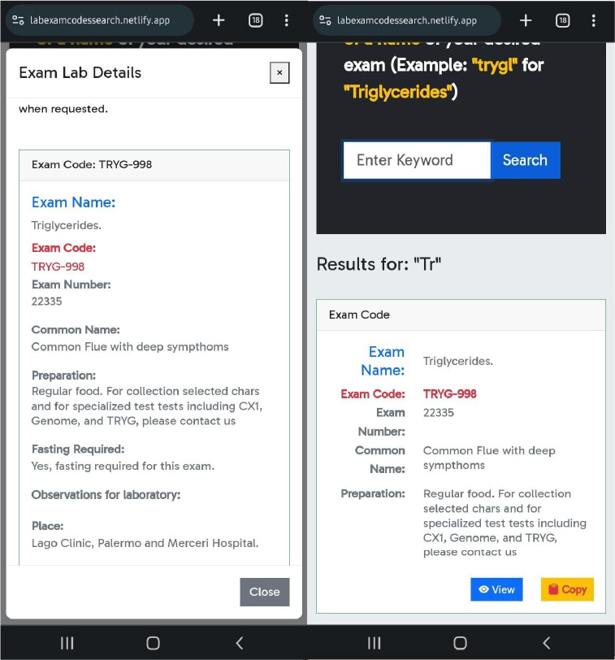
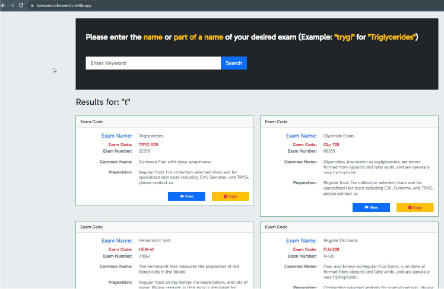

# Documentation

- The app can be previewed at [https://labexamcodessearch.netlify.app/](https://labexamcodessearch.netlify.app/)

## Repository Description 

- It contains the fron-end app of the backend at [https://github.com/sdsanchezm/exam-laboratory-codes-app] (written in C# .Net 6)
- This repository, contains a Front-End application made in Angular-Bootstrap.
    - It includes features such as:
        - Fetch Data from an API.
        - Search Feature from an api results (pressing button and hitting enter).
        - Copy the specific Exam code to clipboard by clicking 1 button.
        - A Pop-up modal shown after clicking an specific result.
        - Responsive, Intuitive and easy to user interface.
        - Actual results text.

## Project Description

### What is this project about
- This project is a solution for a business environment that requires efficiency in a business process.

### Problem
- When end-users and potential clients of a laboratory, call to request an exam, the agent requires an specific exam code that is not easily identified by the client.

### Solution
- This project allows to quickly enter a word or keyword of the common name of an exam and quickly identify the Exam code required. 
- Also, allows to identify the recommendations, preparations and other details of the exam itself.

### Value
- This application allows to reduce the time that a potential client is over the phone in 50% of the time.
- This application, reduce the time in average from 10 minutes over the phone to 5 mins or less over the phone.

## Screens

  

 

